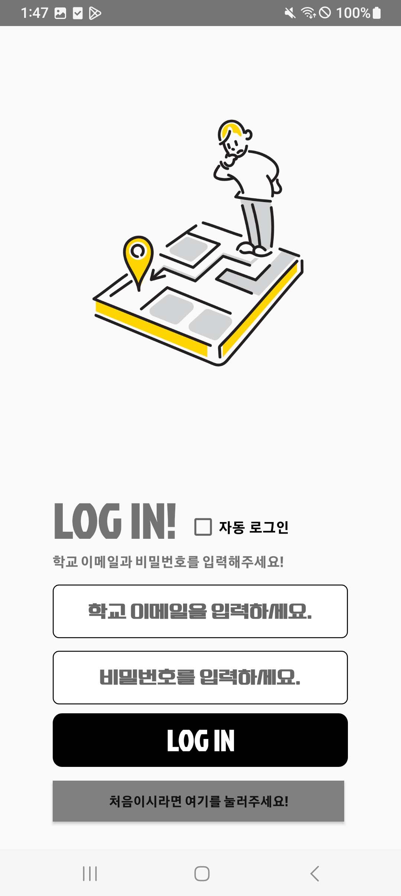
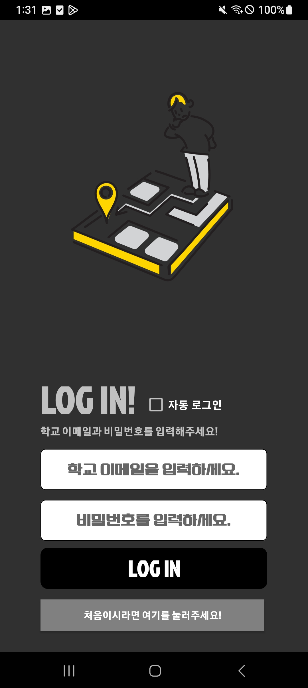
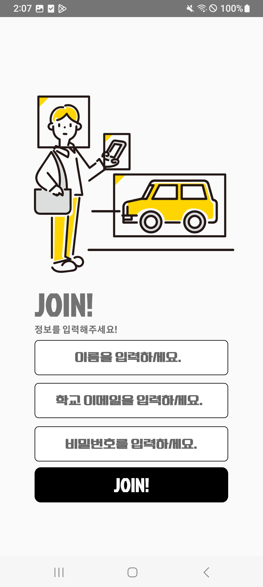
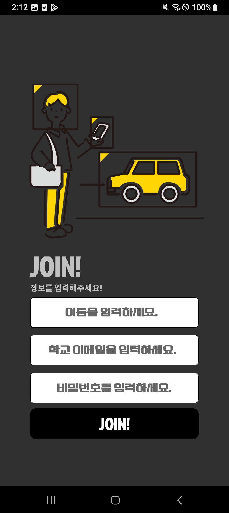
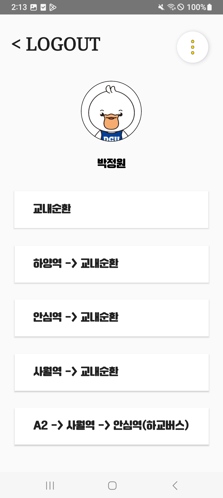
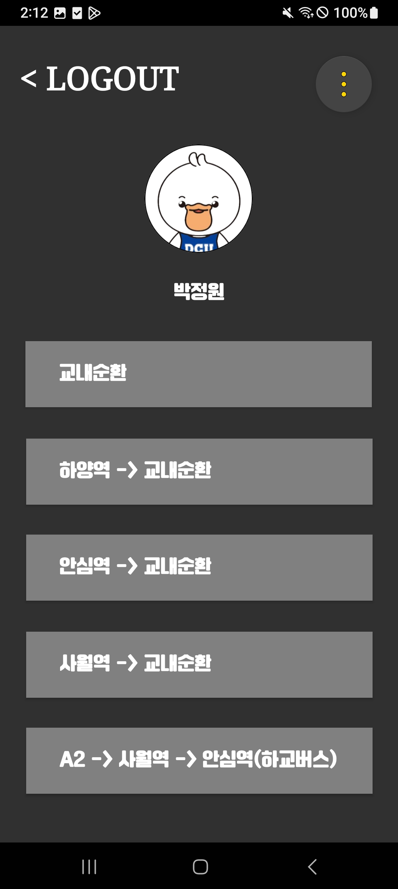
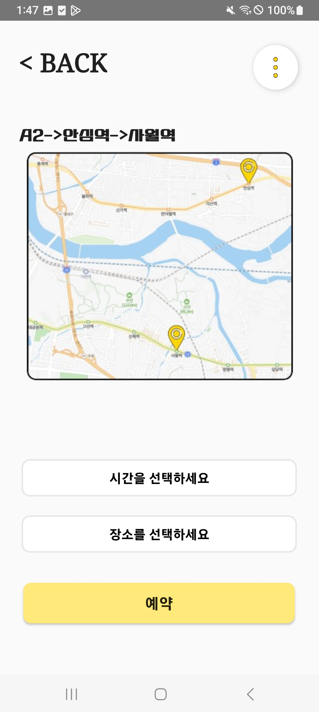
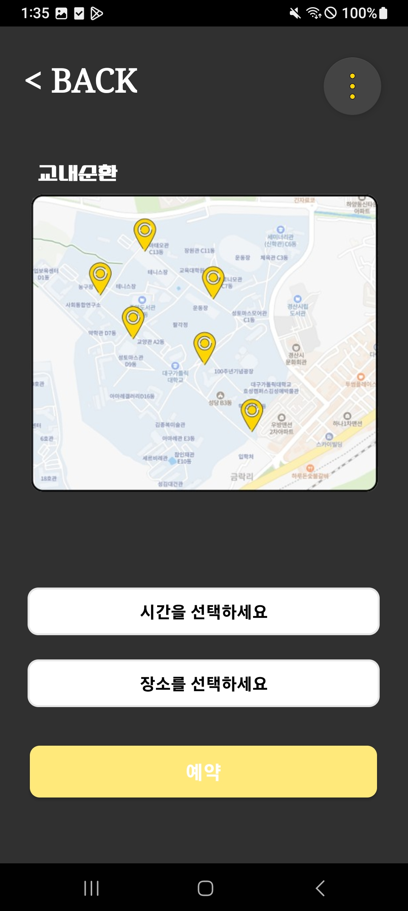
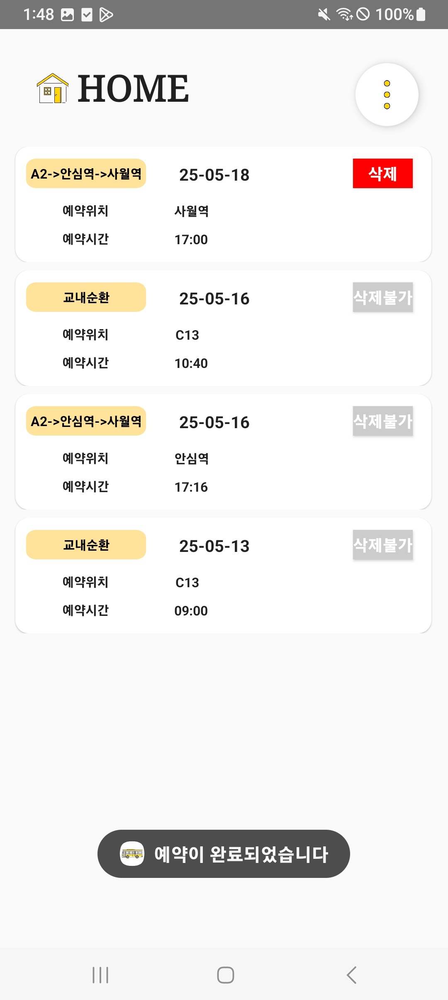
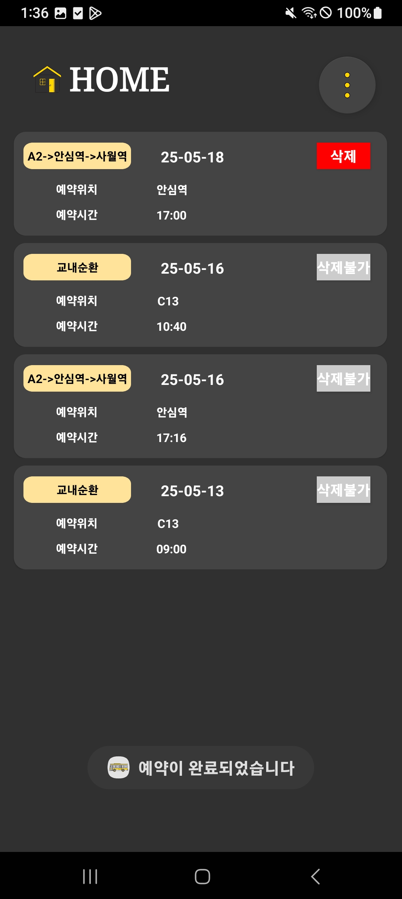

# 모교 스쿨버스 예약 시스템 사용자용 (리팩토링 버전)

-RefacSchoolBusReservationForUser-kotlin

- 2024 대구가톨릭대학교 캡스톤디자인 🥉장려상 수상작(스쿨버스 예약 시스템) Kotlin 리팩토링 버전입니다.  
-기존 Java 버전의 구조를 개선하고, 사용자 경험(UX)과 인터페이스(UI)을 향상시켰습니다.

---

## 주요 기능

### 1. 로그인 [Login.kt](app/src/main/java/com/example/refac_userbus/Login.kt) / 회원가입 화면 [Register.kt](app/src/main/java/com/example/refac_userbus/Register.kt)
- [로그인, 회원가입](https://github.com/wonna-0830/login)

- [로그인 XML](app/src/main/res/layout/activity_login.xml)
- [회원가입 XML](app/src/main/res/layout/activity_register.xml)
- Firebase Authentication을 이용한 이메일/비밀번호 로그인
- 자동 로그인 기능(CheckBox 활용) => sharedPreference
- 회원가입 후 Firebase에 사용자 정보 저장
- 이메일 양식이 아니거나 둘 중 하나 이상이 공란일 때 로그인 비활성화
- 이메일 양식이 아니거나 둘 중 하나 이상이 공란, 비밀번호가 8자리 미만일 시 회원가입 비활성화

### 2. 노선 선택 화면 [RouteChoose.kt](app/src/main/java/com/example/refac_userbus/RouteChoose.kt)
- [레이아웃](https://github.com/wonna-0830/routechoose)

- [XML](app/src/main/res/layout/activity_routechoose.xml)
- 4개의 등교노선과 1개의 하교선택 버튼으로 구성
- 클릭 시 선택한 노선에 따라 TimePlace 페이지 내 구성요소 변경 (TextView, Spinner 내 시간과 정류장, 지도 화면)

### 3. 시간 및 정류장 선택 화면 [TimePlace.kt](app/src/main/java/com/example/refac_userbus/TimePlace.kt)
- 레이아웃 [보러가기](https://github.com/wonna-0830/timeplace)

- [XML](app/src/main/res/layout/activity_timeplace.xml)
- 선택한 노선에 따라 Spinner, 이미지 뷰, 텍스트 뷰를 동적으로 갱신
- 예약 가능한 시간만 필터링하여 표시 (현재 시간 기준 이후 시간만)
- 시간과 정류장 중 하나 이상 선택하지 않았을 때 예약 버튼 비활성화
- ProgressBar로 로딩 상태 표시
- 예약 완료 시 Firebase Firestore에 저장
- 예약 중복 제한(등교/하교 각각 하루에 1건만 가능하도록)

### 4. 예약 확인 화면 [SelectBusList.kt](app/src/main/java/com/example/refac_userbus/SelectBusList.kt)
- 레이아웃 [보러가기](https://github.com/wonna-0830/selectbuslist)

- [XML](app/src/main/res/layout/activity_selectbuslist.xml)
- 사용자가 예약한 내역을 리스트로 조회
- 예약이 없을 경우 안내 메시지 표시
- 각 예약 항목에 대해 삭제 버튼 제공 (시간이 지나면 삭제불가 기능 준비 중)
- 삭제 시 실시간으로 Firebase에서 제거
- 예약 후 버스 탑승 시간 10분 전 알람 이벤트 기능(테스트 미완료)

### 5. 공통 기능 (FAB 및 설정 등)
- [Floating Action Button](images/light_fab)으로 아래 기능 접근 가능:
  - 학교 홈페이지의 스쿨버스 노선 페이지로 이동
  - 예약 확인 화면 바로가기
  - 로그아웃
  - 다크모드 전환 토글 (사용자 기기에 따라 테마 적용)
- 기기 내 뒤로가기 버튼 두 번 클릭 시 어플리케이션 종료

---

## 사용 기술

| 분류 | 기술 |
|------|------|
| 언어 | Kotlin |
| IDE  | Android Studio |
| DB   | Firebase Firestore |
| 인증 | Firebase Authentication |
| 구조 | MVVM 일부 적용 (단계적 도입 중) |
| 기타 | RecyclerView, Spinner, ViewBinding 등 |

---

## 🔄 리팩토링 포인트

- **Java → Kotlin 전환**으로 코드 가독성 및 유지보수성 향상
- **XML 구조 개선**
  - 노선별로 나눠져 있던 여러 XML 레이아웃을 하나의 **동적 공통 레이아웃 구조**로 통합
- **UX 개선**
  - **하루 1건 예약 제한 기능**으로 중복 예약 방지
  - 현재 시간 기준으로 **Spinner 필터링**: 예약 불가능한 시간은 자동 제외
  - **FAB 버튼**을 통해 홈피 이동, 예약 내역 확인, 로그아웃 등 자주 쓰는 기능에 빠르게 접근 가능
- **UI 개선**
  - 사용자 기기 테마에 따라 **다크모드 자동 대응**
  - 데이터 로딩 중에는 **ProgressBar로 시각적 상태 표시**
- **구조적 개선 및 확장성 확보**
  - Firebase Authentication 기반으로 사용자 정보 분리 관리
  - 예약 데이터는 Firestore에 구조화하여 저장 → 향후 검색, 정렬 등 기능 확장 가능

---

> 📌 스크린샷 및 시연 영상은 추후 업데이트 예정입니다!
